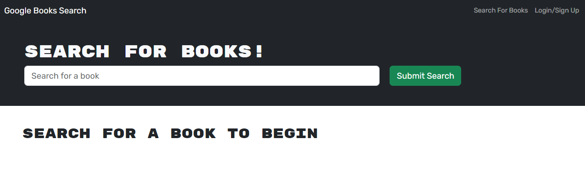

# GraphQL Engine

# Description
With this GraphQL app utilizing the Google Books API, search for any books you like and save them to your personal login.

# Usage
## Website Preview
- Website Link: https://graphql-engine-5zyl.onrender.com
- Repository Link: https://github.com/clendinning1/graphql-engine

# Tools
- [Apollo](https://www.apollographql.com/docs/apollo-server/)
- [Bootstrap](https://getbootstrap.com/)
- [GraphQL](https://graphql.org/)
- [React](https://react.dev/)
- [Express](https://expressjs.com/)
- [JWT](https://jwt.io/)
- [Mongoose](https://mongoosejs.com/)